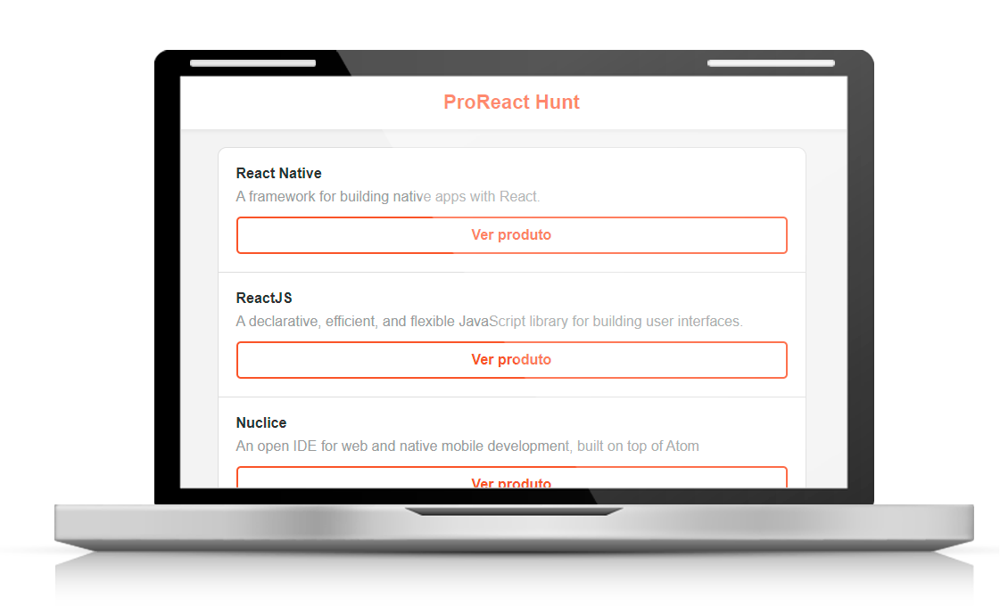

<h1 align="center">Welcome to REACT-PROHUNT 👋</h1>

<p align="center">
  
</p>

### HOW CAN YOU USE IT:
- Clone this repository: `git clone "this-repository-url"`

## Install
Enter to individual folder and:

```sh
npm install
```


## Usage
Enter to individual folder and:

```sh
npm start or npm run dev
```

## 💻 About the Project
<h2>A very simple ReactJS APP with frontend and backend to mimetize Product Hunt site.</h2>

 ## 💻 Technologies
<h4 align="center">
   - CSS, Flexbox
</h4>

## :memo: License

This project is under the MIT license. For more details visit: [LICENSE](.github/LICENSE.md).
